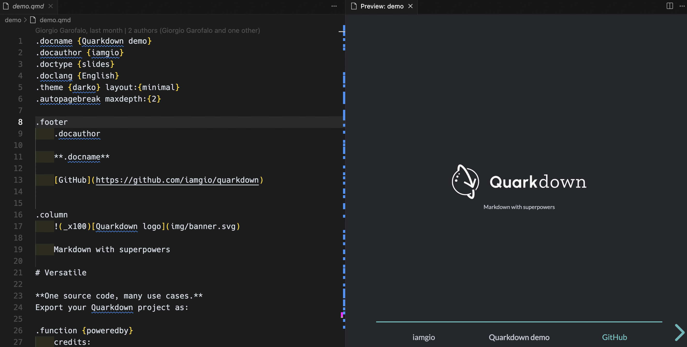

# Quarkdown Preview

Preview your `.qmd` file in VSCode, like markdown.

## Features

- **Live Preview**: Open a live preview of your `.qmd` file side by side with the editor. Any changes you make in the editor will be reflected instantly in the preview.
- **Create New Project**: Easily create a new Quarkdown project.
- **Compile to HTML**: Compile your Quarkdown document to an HTML file.
- **Compile to PDF**: Compile your Quarkdown document to a PDF file.

## Commands

You can access these commands from the VS Code Command Palette (`Ctrl+Shift+P` or `Cmd+Shift+P`):

- `Quarkdown: Open Preview to the Side`: Opens a preview panel for the current `.qmd` file.
- `Quarkdown: Create New Project`: Initiates the process to create a new Quarkdown project.
- `Quarkdown: Compile Document to HTML`: Compiles the active `.qmd` document to an HTML file.
- `Quarkdown: Compile Document to PDF`: Compiles the active `.qmd` document to a PDF file.

## Configuration

You can configure the following settings in VS Code's settings (`File > Preferences > Settings`):

- `quarkdownPreview.quarkdownPath`: Specifies the path to the Quarkdown executable. If Quarkdown is in your system's PATH, you can simply use `quarkdown`. Default is `quarkdown`.
- `quarkdownPreview.outputDirectory`: Sets the compilation output directory. An empty value means using the system's temporary directory. Default is empty.

## Usage

1.  **Open a `.qmd` file**: Open any file with the `.qmd` extension in VS Code.
2.  **Open Preview**: Use the command `Quarkdown: Open Preview to the Side` from the Command Palette, or click the "Open Preview" icon in the editor's title bar when a `.qmd` file is open.
3.  **Compile**: Use the "Compile Document to HTML" or "Compile Document to PDF" commands to generate output files.

# Quarkdown Preview

在VS Code中预览您的`.qmd`文件，就像预览Markdown文件一样。

## 功能

- **实时预览**: 在编辑器旁边打开`.qmd`文件的实时预览。您在编辑器中所做的任何更改都将立即反映在预览中。
- **创建新项目**: 轻松创建新的Quarkdown项目。
- **编译为HTML**: 将您的Quarkdown文档编译为HTML文件。
- **编译为PDF**: 将您的Quarkdown文档编译为PDF文件。

## 命令

您可以通过VS Code命令面板（`Ctrl+Shift+P` 或 `Cmd+Shift+P`）访问以下命令：

- `Quarkdown: Open Preview to the Side`: 为当前`.qmd`文件打开一个预览面板。
- `Quarkdown: Create New Project`: 启动创建新Quarkdown项目的过程。
- `Quarkdown: Compile Document to HTML`: 将当前活动的`.qmd`文档编译为HTML文件。
- `Quarkdown: Compile Document to PDF`: 将当前活动的`.qmd`文档编译为PDF文件。

## 配置

您可以在VS Code的设置中（`文件 > 首选项 > 设置`）配置以下内容：

- `quarkdownPreview.quarkdownPath`: 指定Quarkdown可执行文件的路径。如果Quarkdown已添加到系统PATH中，则可以直接使用`quarkdown`。默认为`quarkdown`。
- `quarkdownPreview.outputDirectory`: 设置编译输出目录。空值表示使用系统临时目录。默认为空。

## 使用方法

1.  **打开`.qmd`文件**: 在VS Code中打开任何以`.qmd`为扩展名的文件。
2.  **预览**: 从命令面板使用`Quarkdown: Open Preview to the Side`命令，或者在打开`.qmd`文件时点击编辑器标题栏中的"Open Preview to the Side"图标。
3.  **编译**: 使用"Compile Document to HTML"或"Compile Document to PDF"命令生成输出文件。